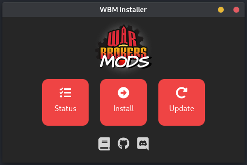

# WBM-installer

Installer for War Brokers Mods (WBM).

<p align="center">
  
</p>

## Installing

instructions

## Contributing

**⚠️ High CPU usage warning ⚠️**

Running `yarn tauri XXX` command will use a LOT (I mean A **LOT**) of computing resource.
No worries though, this is only for the first execution and it will be much quicker next time.

- versions in [`./src-tauri/Cargo.toml`](./src-tauri/Cargo.toml) is irrelevant. The version in [`./src-tauri/tauri.conf.json`](./src-tauri/tauri.conf.json) is the real deal.
- Icons are from [svelte-icons](https://github.com/Introvertuous/svelte-icons)

### 0. Requirements

- nodejs v16 LTS
- cargo
- yarn
- git

### 1. Setup

- [Setup tauri](https://tauri.studio/en/docs/getting-started/intro/#setting-up-your-environment)
- install dependencies

  ```bash
  yarn install
  ```

### 2. Run in development mode

Start the application in development environment with testing tools and hot reloading.

```bash
yarn tauri dev
```

- This command should be used for testing since the app may render differently in your browser.
- You might get a `Port 8080 is taken` warning because the previous dev server isn't properly closed.
  Exiting and reopening the terminal should fix the issue.

### 3. Build for production

Build the application for release.

```bash
yarn tauri build
```

## License

The source code for this project is available under the [MIT license](./LICENSE).
